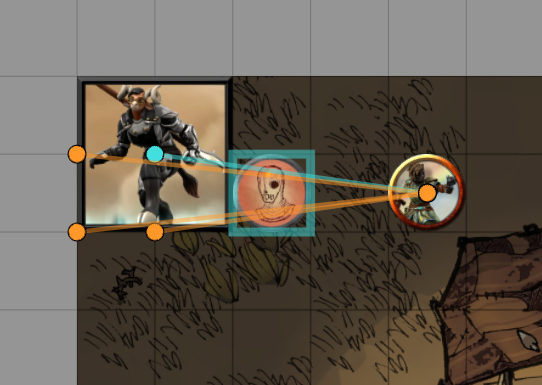

## Foundry VTT PF2e Flanking Helper
Simple visualizer for possible flanking positions with allies.

## Installation
Manifest URL: https://github.com/avenzi/foundry_pf2e_flank_helper/raw/master/module.json

## Usage
- Adds a toggle button to each token's HUD to enable/disable the flanking visualizer.
- Visualizer will show all possible valid placements for the selected token that will flank an enemy.
- Placing the token at one of those positions will highlight the flanked enemy.
- Accounts for token size, reach, and valid placement.
- Walls will disrupt flanking.

In this example, we see the possible flanking positions of the medium-sized ally to the right, who has a 10ft reach. The enemy in the middle is currently flanked.

From the large-sized ally's perspective (who also has a 10ft reach), we see the possible flanking positions on the left, with each dot representing where you would place the center of the token.

## TODO
- Some edge types should not block flanking?

